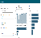

<h1 align="center">Hi, I'm Pranjali! 👋</h1>
<h2 align="center"> Data Analyst || BI enthusiast and Data storyteller </h2>

### Dashboards
 

##### [ Workplace Analytics DB](https://github.com/Pranjali-d/Workspace-Analytics_Dashboard) 

<!--
**Pranjali-d/Pranjali-d** is a ✨ _special_ ✨ repository because its `README.md` (this file) appears on your GitHub profile.

Here are some ideas to get you started:

- 🔭 I’m currently working on ...
- 🌱 I’m currently learning ...
- 👯 I’m looking to collaborate on ...
- 🤔 I’m looking for help with ...
- 💬 Ask me about ...
- 📫 How to reach me: ...
- 😄 Pronouns: ...
- ⚡ Fun fact: ...
-->
